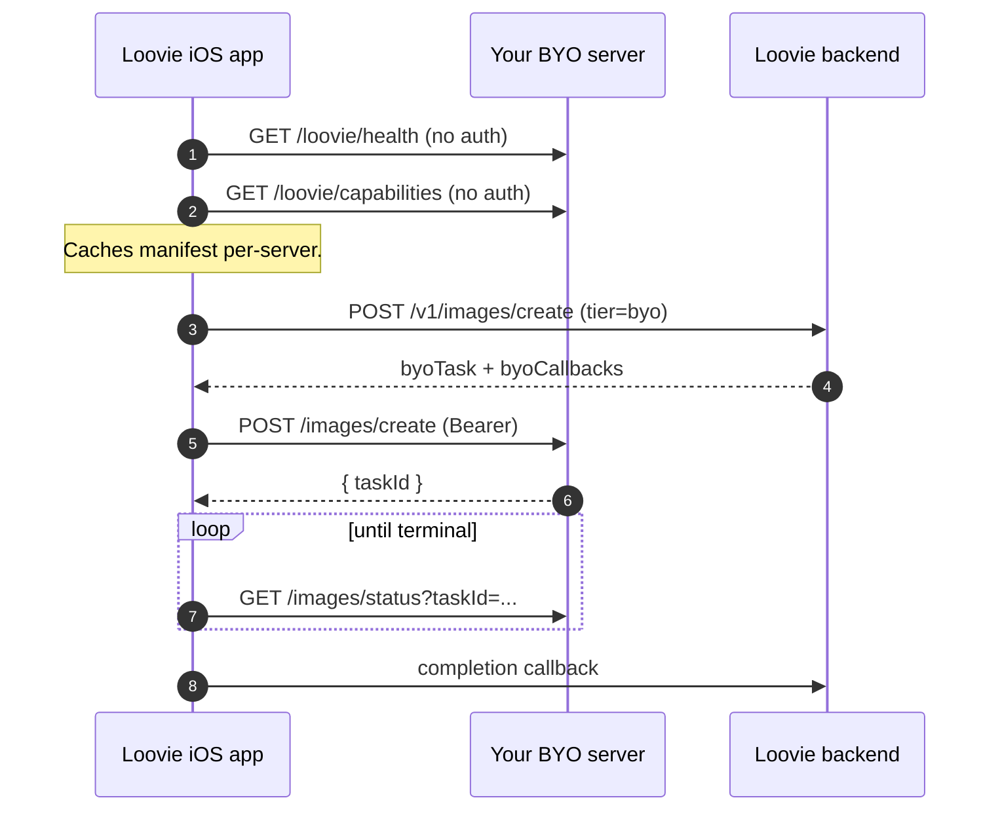

# Loovie Community

> The open contract and reference servers for the **Loovie BYO** (Bring Your Own) generation protocol. Run Loovie image and single-shot video on your own GPU. Free at the Loovie layer.

[](LICENSE)
[](https://github.com/looviehq/loovie-community/actions)
[](https://api.securityscorecards.dev/projects/github.com/looviehq/loovie-community)
[](https://github.com/looviehq/loovie-community/releases)

## Why this exists

Loovie is model‑agnostic. BYO is the logical end of that: if you have the hardware, your generations should be yours, private, and **free at the Loovie layer**. We open the contract so any HTTP server that implements it can be the backend for your Loovie image and video generations. ComfyUI is the reference we ship; nothing in the app requires it.

In the Loovie iOS app this appears as **Your server (BYO)** under image and video quality.

## 30‑second quickstart

Pick whichever path matches your hardware. Both produce a server that the Loovie iOS app will pick up under *Preferences → BYO server*. Many other paths work too (any cloud GPU provider like QuickPod / Vast.ai / Lambda, a port forward on your router, etc.), see [docs/00-overview.md](docs/00-overview.md).

```sh
# A. Rent a GPU on RunPod (~10 minutes, easiest)
#    Import the template at docker/runpod-template.json in the RunPod console,
#    set LOOVIE_API_TOKEN + HF_TOKEN, deploy. Full walkthrough:
open https://github.com/looviehq/loovie-community/blob/main/docs/30-runpod.md

# B. Run on your own GPU using the reference workflows we ship.
#    FLUX.2 Klein image works on 4090/5090; LTX-2.3 video on 5090. Swap in
#    lighter models (or different ones entirely) and lighter GPUs work too.
git clone --branch v0.21.1 --depth 1 https://github.com/comfyanonymous/ComfyUI.git
cd ComfyUI && python3 -m venv .venv && source .venv/bin/activate
pip install --extra-index-url https://download.pytorch.org/whl/cu124 torch torchvision torchaudio
pip install -r requirements.txt
cd custom_nodes && git clone https://github.com/looviehq/loovie-community.git && ln -s loovie-community/comfyui-loovie loovie
cd .. && export HF_TOKEN=hf_xxx LOOVIE_API_TOKEN=$(bash custom_nodes/loovie-community/scripts/new-token.sh)
bash custom_nodes/loovie-community/docker/download_models.sh && python main.py --listen 0.0.0.0 --port 8188
```

## What you can do with it

The Loovie app speaks five capability modes. The "Reference workflow" column shows what `comfyui-loovie/` ships out of the box for each mode; you can swap any of these for a different model (WAN, HunyuanVideo, CogVideoX, SDXL, anything else) or write your own workflow, as long as it produces the same input/output shape as the contract requires.

| Capability | Mode | Reference workflow (one of many possible) |
|---|---|---|
| Text → image | `t2i` | FLUX.2 Klein |
| Image → image (refs + edit) | `i2i` | FLUX.2 Klein |
| Text → single‑shot video | `t2v` | LTX‑2.3 fast / pro |
| Image → single‑shot video | `i2v` | LTX‑2.3 fast / pro |
| First‑and‑last‑frame → video | `fl2v` | LTX‑2.3 fast / pro |

**You can also bring your own inference backend.** ComfyUI is the reference we publish (`comfyui-loovie/`), but anything that speaks the contract is valid: Wan2GP, a hand-rolled FastAPI / Express / Go server, a different node-graph engine, etc. We ship a minimal FastAPI example at [`examples/minimal-server/`](examples/minimal-server/) precisely so you can see how short the non-Comfy path can be. **The contract is the line, not the implementation.**

Multi‑shot video, local LLM, and MCP tooling are on the post‑beta roadmap.

## Architecture



The Loovie backend **never** calls your server. The mobile app does. Direct device‑to‑server traffic is the only path. See *Privacy* below.

## Repo map

| Path | What it is |
|---|---|
| [`openapi/`](openapi/) | The normative HTTP contract (OpenAPI 3.1). **Start here if you're writing your own server.** |
| [`comfyui-loovie/`](comfyui-loovie/) | Reference ComfyUI implementation (FLUX.2 Klein + LTX‑2.3). 127 unit tests, 88% coverage on the in‑scope modules. |
| [`examples/minimal-server/`](examples/minimal-server/) | Framework‑agnostic FastAPI reference, runnable without a GPU. Used as the schemathesis target in CI. |
| [`docker/`](docker/) | Dockerfile, RunPod template, model downloader (with HuggingFace + gated‑model handling). |
| [`docs/`](docs/) | Account creation, hosting paths, Cloudflare tunnel, security, troubleshooting, contribution recipes, the contract human‑readable, model licences. |

## Privacy in one paragraph

Your BYO server URL and bearer token live in the **Loovie app on your device only**, they have to, because the app is what calls your server. They are **never sent to Loovie's backend servers and are not accessible to Loovie staff**. Uninstall the app or tap *Clear saved server* in Preferences and they are gone, there is no copy in our cloud to be deleted. The metadata we do store about a generation (prompt, parameters, the final media file) is the same as for any Loovie generation. Details: [LEGAL.md](LEGAL.md), [docs/15-terms-and-privacy.md](docs/15-terms-and-privacy.md), and [loovie.app/privacy](https://loovie.app/privacy).

## Status

**Public beta.** Free in the Loovie app while in beta (no subscription, no credits). After beta we expect to introduce a small flat‑fee *BYO Pass* subscription. **Generations stay 0 credits forever.** If you rent a GPU (e.g. RunPod), that provider charges you separately; Loovie itself charges nothing for BYO.

### Beta API stability, read this before you depend on the contract

While we are on the `0.x` line, **the BYO HTTP contract may introduce breaking changes between minor versions.** Every change is documented in [CHANGELOG.md](CHANGELOG.md) and reflected in `info.version` on the spec (and `schemaVersion` on the capabilities manifest when the shape changes). **Pin to a specific tag or commit SHA** if you depend on it. The contract becomes strict semver at `1.0.0`.

### Roadmap (no dates)

- [x] Image + single-shot video reference implementation (`v0.1.x-beta`)
- [x] Public OpenAPI contract
- [x] Docker + RunPod template
- [x] HuggingFace gated‑model handling
- [ ] release‑please + GHCR image signing (cosign + SBOM)
- [ ] Rendered OpenAPI on GitHub Pages
- [ ] ComfyUI registry publication
- [ ] Multi‑shot video
- [ ] Local LLM endpoints
- [ ] MCP server example

## Contributing

We use **DCO sign‑off** (`git commit -s`), not a CLA, and **Conventional Commits** on the subject. See [CONTRIBUTING.md](CONTRIBUTING.md). New workflows are very welcome, see [`docs/80-adding-a-workflow.md`](docs/80-adding-a-workflow.md).

## Security

Vulnerabilities go through [GitHub Private Vulnerability Reporting](https://github.com/looviehq/loovie-community/security/advisories/new) (preferred) or `security@loovie.app`. **Do not** open a public issue. See [SECURITY.md](SECURITY.md).

## Community

Community‑supported beta, best‑effort, no SLA. The Loovie Discord is the primary support venue once the server opens, invite link will appear here. Until then, [GitHub Discussions](https://github.com/looviehq/loovie-community/discussions) is the fallback.

## License

Apache‑2.0, see [LICENSE](LICENSE) and [NOTICE](NOTICE). Bundled and referenced **models are not ours**, each has its own license, including some that are gated on HuggingFace. See [docs/MODELS.md](docs/MODELS.md). You are responsible for accepting model licenses before downloading them.
