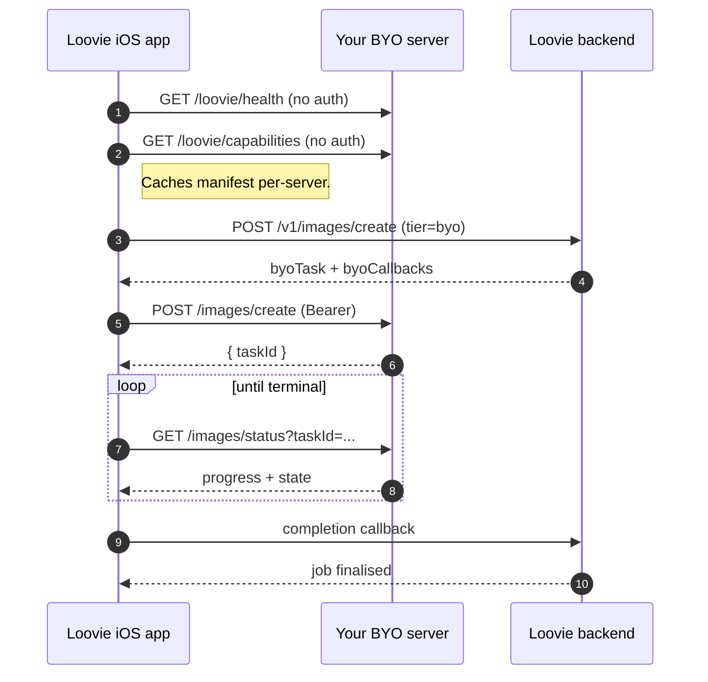

# The BYO contract in human-readable form

This page is a friendly companion to the normative OpenAPI 3.1 spec at [`openapi/loovie-server.openapi.yaml`](../openapi/loovie-server.openapi.yaml). The YAML is the source of truth; this page paraphrases the same shape so you can implement the contract without reading YAML.

> **Beta API stability.** While we are on the `0.x` line, this contract may introduce breaking changes between minor versions. We document every change in [`CHANGELOG.md`](../CHANGELOG.md) and reflect it in `info.version` (and `schemaVersion` on the capabilities manifest when the shape changes). Pin to a specific tag or commit SHA if you depend on it. Strict semver kicks in at `1.0.0`.

## The big picture



The Loovie backend **never** calls your server. The mobile app does. Direct device-to-server traffic is the only path. Your server URL and bearer token live in the app on the user's device only; they are not accessible to Loovie staff or sent to Loovie's backend.

## ANY server, ANY model, ANY backend

Three things are **not** part of the contract and you can swap them independently:

1. **The inference backend.** ComfyUI is the reference we publish (`comfyui-loovie/`), but anything serving HTTP works: Wan2GP, a hand-rolled FastAPI / Express / Go server, a different node-graph engine, a wrapper around `diffusers`, etc. A small FastAPI proof lives in `examples/minimal-server/`.
2. **The model.** FLUX.2 Klein and LTX-2.3 are what our reference workflows use, but the contract knows nothing about which model is running. Image: SDXL, SD3.5, Stable Cascade, Lumina, HiDream, your own fine-tune, whatever. Video: WAN 2.x, HunyuanVideo, CogVideoX, Mochi, AnimateDiff variants, whatever. You're responsible for the licence on whichever model you pick.
3. **The hardware.** NVIDIA, AMD (ROCm), Apple Silicon, multi-GPU, single-GPU: the contract has nothing to say. Your model and workflow set the VRAM floor, not us.

The contract is the line. If your server speaks the request and response shapes below, the Loovie app will drive it the same way it drives ours.

## Endpoints are conditional on capabilities

A server that omits `images` from `/loovie/capabilities` MAY omit `/images/create` and `/images/status` entirely. Same for `ss_videos` and `/videos/*`. The app only calls the endpoints your capabilities advertise.

`/loovie/health` and `/loovie/capabilities` are **always required** and **always unauthenticated**.

## The required endpoints

### `GET /loovie/health` (no auth)

Returns a small readiness signal.

```json
{
  "code": 200,
  "data": {
    "version": "0.1.0",
    "status": "ok",
    "phase": "ready",
    "detail": ""
  }
}
```

`phase` is one of `ready`, `booting_up`, `downloading_models`. `status` is `"ok"` once the real extension is loaded.

### `GET /loovie/capabilities` (no auth)

The single most important endpoint. Tells the app what your server can do.

```jsonc
{
  "schemaVersion": 1,        // int, REQUIRED. Currently 1.
  "version": "0.1.0",        // optional string, telemetry only.
  "images": {                // OMIT entire object if no image workflows.
    "capabilities": ["t2i", "i2i"],   // closed enum t2i|i2i
    "referenceCount": 4,              // int, max image_urls for i2i
    "resolution": ["720p", "1K", "2K"],   // closed enum
    "variants": ["fast", "pro"],          // closed enum
    "aspectRatios": ["auto", "1:1", "16:9", "9:16", "4:3"],  // closed enum
    "promptCharLimit": 3000               // optional, default 3000
  },
  "ss_videos": {             // OMIT if no video workflows. NOTE: not `videos`.
    "capabilities": ["t2v", "i2v", "fl2v"],   // closed enum
    "referenceCount": 1,
    "resolution": ["720p", "1080p"],          // closed enum (different from image)
    "variants": ["fast", "pro"],
    "aspectRatios": ["auto", "16:9", "9:16", "1:1"],   // closed enum (no 4:3 for video)
    "durations": [1, 2, 3, 4, 5, 6, 7, 8],             // explicit list, may be non-contiguous
    "supportsAudio": true,                              // bool
    "promptCharLimit": 3000
  }
}
```

**Hard rules.** Unknown enum values fail the entire parse, the app falls back to bundled defaults and fires `byo_caps_schema_unsupported` analytics. `schemaVersion` is currently `1`; bump only when the shape changes. Omit sections you can't serve. `promptCharLimit` `3000` is the server's real hard cap.

### `POST /images/create` (Bearer, conditional on `images`)

```jsonc
{
  "prompt": "a red bicycle in front of a Parisian café",
  "mode": "t2i",             // or "i2i"
  "variant": "fast",         // or "pro"
  "aspect_ratio": "16:9",
  "image_urls": ["https://..."],   // for i2i; up to capabilities.referenceCount
  "mask_url": "https://...",       // optional
  "seed": -1                       // -1 = random
}
```

Response (taskId is opaque):

```json
{ "code": 200, "data": { "taskId": "task_loovie_0a1b2c3d4e5f" } }
```

### `POST /videos/create` (Bearer, conditional on `ss_videos`)

```jsonc
{
  "prompt": "a slow zoom into a sunflower",
  "mode": "t2v",             // or "i2v" or "fl2v"
  "variant": "fast",
  "resolution": "720p",
  "aspect_ratio": "16:9",
  "duration": 3,             // seconds; must be in capabilities.durations
  "start_frame_url": "https://...",   // required for i2v and fl2v
  "end_frame_url": "https://...",     // fl2v only; requires start_frame_url
  "with_audio": true,                 // only when supportsAudio
  "seed": -1
}
```

Same response envelope: `{ "code": 200, "data": { "taskId": "..." } }`.

### `GET /{images,videos}/status?taskId=...` (Bearer)

```jsonc
{
  "code": 200,
  "data": {
    "taskId": "task_loovie_...",
    "state": "pending|processing|success|failed",
    "progress": 0,                 // 0..100
    "elapsedSeconds": 12.3,
    "step": 5,                     // optional
    "totalSteps": 30,              // optional
    "currentNode": "KSampler",     // optional

    // success only:
    "resultJson": "{\"resultUrls\":[\"https://...\"]}",   // JSON-encoded STRING
    "totalSeconds": 42.0,

    // failed only:
    "failCode": "EXECUTION_ERROR",
    "failMsg": "missing model file: gemma_3_..."
  }
}
```

`resultJson` is a **JSON-encoded string**, not a nested JSON object. Inside it is `{"resultUrls":["<url>"]}` (single result expected). The app downloads from `resultUrls[0]`.

`404` → `{ "code": 404, "msg": "Task not found" }`.

### `POST /loovie/upload` (Bearer, optional helper)

Multipart `file=…` OR JSON `{ "filename": "…", "data_base64": "…" }`. Returns `{ filename, url, sizeBytes }`.

You don't need to implement this if your operator workflow doesn't push files into the server. The Loovie app does not use it, the app references images via URL.

## Auth

Static bearer token of your choosing. Required for remote callers. Localhost (`127.0.0.1` / `::1`) **may** bypass auth, the contract allows it but doesn't require it. **The server MUST [fail closed](50-security-and-tokens.md#what-fail-closed-means) when no token is configured and the caller is non-loopback** (in plain English: refuse the request rather than letting it through unauthenticated). Returning anything other than `401` for an unauthenticated remote request is a protocol violation.

`/loovie/health` and `/loovie/capabilities` are always unauthenticated, even when a token is configured.

## Server is poll-based

Create returns a `taskId`. The app polls `/status` until terminal. The server does **not** push. (There is an optional `callback_url` field on create that the Loovie *cloud* uses for its own durability; BYO does not rely on it.)

## Prompt length

The contract advertises a `promptCharLimit` (default 3000) per section. The server MUST reject prompts longer than this with a `400`-class response. Hard cap is 3000; the app caps input to whatever you advertise.

## failCode vocabulary

The server-side failCodes the reference implementation emits:

- `WORKFLOW_NOT_FOUND`: the requested workflow / variant isn't installed.
- `SUBMISSION_ERROR`: the workflow couldn't be submitted to ComfyUI.
- `EXECUTION_ERROR`: a node blew up during execution.
- `OUTPUT_MISSING`: workflow ran but produced no output file.
- `HISTORY_MISSING`: task disappeared from history (server restart mid-run).
- `TIMEOUT`: generation exceeded `max_wait_seconds` for the workflow.

Custom servers may emit additional codes; the Loovie app prefixes any non-`BYO_*` code with `BYO_` at the failure boundary, so e.g. `OUTPUT_MISSING` becomes `BYO_OUTPUT_MISSING` in the Loovie error-tracking funnel.

## Result media size and type

The Loovie app validates the result file before uploading it to Loovie:

- **Magic bytes** must match the declared MIME (PNG / JPEG / WebP for images, MP4 / WebM for video).
- **Decode probe** must succeed.
- **Size cap**: <= 50 MB images, <= 500 MB videos.

Anything failing is rejected with `BYO_INVALID_RESULT` on the device side and never reaches Loovie. Make sure your workflow's save node emits a real, decodable file in one of these formats.

## A worked curl example

```sh
TOKEN="$(bash scripts/new-token.sh)"
BASE="http://localhost:8188"

# Probe.
curl -s "$BASE/loovie/health" | jq .
curl -s "$BASE/loovie/capabilities" | jq .

# Create.
TASK_ID=$(curl -s -X POST "$BASE/images/create" \
  -H "Authorization: Bearer $TOKEN" \
  -H "Content-Type: application/json" \
  -d '{"prompt":"a red bicycle in Paris", "mode":"t2i", "variant":"fast", "aspect_ratio":"16:9"}' \
  | jq -r .data.taskId)

# Poll.
while true; do
  STATE=$(curl -s "$BASE/images/status?taskId=$TASK_ID" -H "Authorization: Bearer $TOKEN" | jq -r .data.state)
  echo "state=$STATE"
  [[ "$STATE" == "success" || "$STATE" == "failed" ]] && break
  sleep 2
done

# Fetch the result URL.
curl -s "$BASE/images/status?taskId=$TASK_ID" -H "Authorization: Bearer $TOKEN" \
  | jq -r '.data.resultJson | fromjson | .resultUrls[0]'
```

## The OpenAPI spec is authoritative

If this page and the [OpenAPI spec](../openapi/loovie-server.openapi.yaml) disagree, the spec wins. Run `redocly lint --extends=recommended-strict openapi/loovie-server.openapi.yaml` to validate any changes, and `schemathesis run --experimental=openapi-3.1 --base-url <your-server> openapi/loovie-server.openapi.yaml` to validate your implementation against it.
